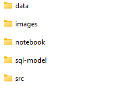
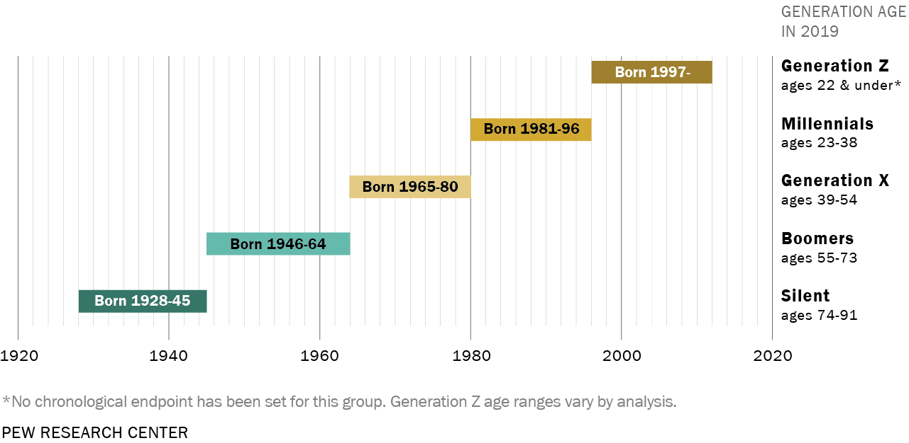
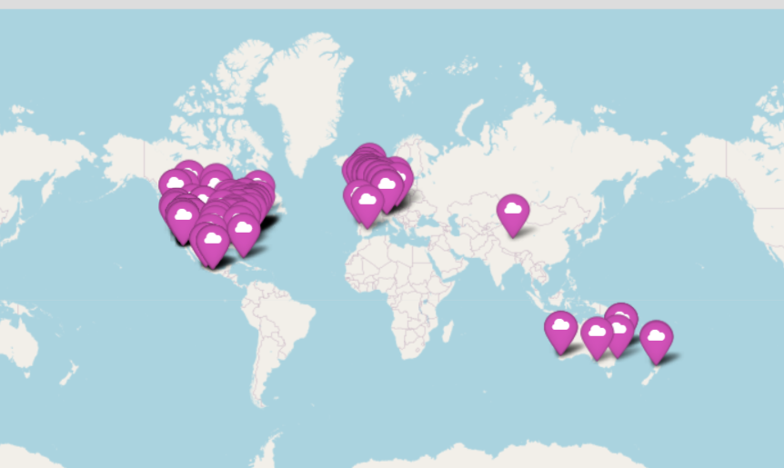
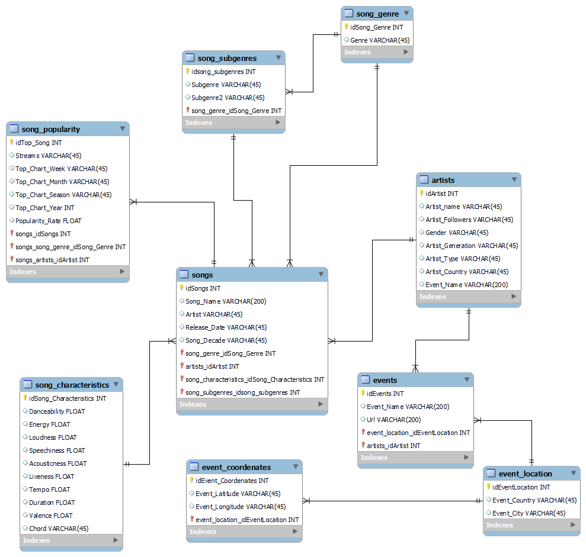
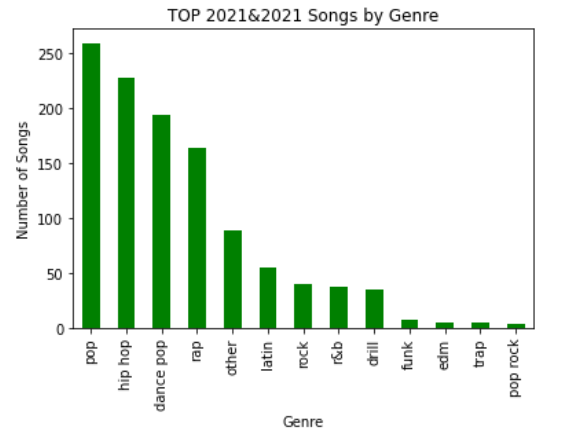
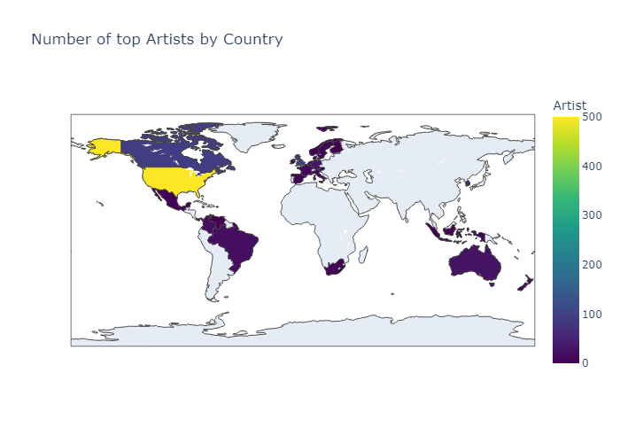
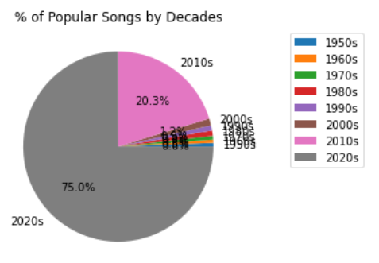
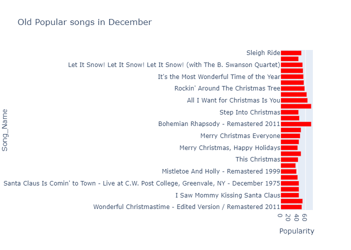

# Project-1: TOP SONGS & ARTISTS DATA ANALYSIS

**Objective**: The objective of this project is to analyze the most popular songs and artists of the last years by manipulating and analyzing a complete and complex dataset, adding information through an API, and loading the generated database to SQL.   

     What music is Trending? Why is it trending?
This Exploratory Data Analysis(EAD) project will end with several conclusions about what has been trending in the world of music in recent years. Thanks to the data set generated you will discover some elements that you may not know yet, so continue reading... you won't regret it! 

## Repository Structure
---
Besides this read me you will find the following folders:

- Data folder: you will find all the csv data files used for this project.
- Images folder: you will find all the images related to this project.
- Notebook folder: inside this folder you will find the following jupyter notebooks:   
    - *Spotify Cleaning*: notebook related to all the extractions and cleaning of the dataset. It will integrate data extraction, cleaning and manipulation.
    - *API ticketmaster_events* : Notebook to integrate addotional information through ticketmaster API.
    - *SQL Spotify Songs and Artists*: Notebook with the code to load the dataset to SQL.
    - *Conclusions*: notebook with interesting conclusions about the project.
- sql-model: the SQL transcript to generate a SQL model with the project database.
- src: a .py file with functions used in this project

## Data extraction
---
Datasets extracted from [Kaggle Data Sets](https://www.kaggle.com/datasets):

- Main dataset: **"Spotify Top 200 Charts (2020-2021)"**
This dataset includes information about all songs that have been on Spotify Top 200 Weekly (Global) charts in 2020 and 2021

- Addtional dataset: **"Spotify Artist Metadata Top 10k"** that will add the following information about the artist: *gender, age, type, country* to the main dataset

## Cleaning  
----
The data will be cleaned and manipulated to reveal interesting conclusions about the world of music in recent years.

In the jupyter notebook: notebook/Spotify Cleaning you will find the cleaning process
 -   **"Spotify Top 200 Charts (2020-2021)"** shape is (1556, 22) and has the following columns: 'Highest Charting Position', 'Number of Times Charted',
       'Week of Highest Charting', 'Song Name', 'Streams', 'Artist',
       'Artist Followers', 'Song ID', 'Genre', 'Release Date', 'Weeks Charted',
       'Popularity', 'Danceability', 'Energy', 'Loudness', 'Speechiness',
       'Acousticness', 'Liveness', 'Tempo', 'Duration (ms)', 'Valence',
       'Chord'
- With an inner merge with the dataset **"Spotify Artist Metadata Top 10k"** we will add to the dataset the following info:*gender, age, type, country* of the artist. Complete df.shape (1157, 26)

### Cleaning Process:
- df.dtypes: make sure the columns types are correct
- Null values: will eliminate null values row ONLY if null values are <1% of the total values of the column

### Data manipulation: 
- **Genre**: Song [Genre] column has the following format:"['indie rock italiano', 'italian pop']". It gives a string with one or more specific genres for the song. With this information I have created 3 columns: 
    - "Genre1": using regex this column will give the first genre inside the string in [Genre] column. Ex. input: "['indie rock italiano', 'italian pop']" output: 'indie rock italiano'. This column will be later rename as [Subgenre]
    - "Genre2": using regex this column will give the second genre (if any) inside the string in [Genre] column. Ex. input: "['indie rock italiano', 'italian pop']" output: 'italian pop'. This column will be later rename as [Subgenre_2]
    - "Genre_Gen": using funzzywuzzy this column will give a more generic song genre inside the list : *"pop", "hip hop", "latin", "rock", "dance pop", "rap", "trap", "pop rock", "funk", "reggaeton", "r&b", "edm", "drill"*

- **Week_Of_Highest_Charting**: this column gives you the week when the spotify song was on higuest charting: Ex. "2021-07-23--2021-07-30". With this information I have created the following columns:
    - "Week_Of_Highest_Charting" will give the start of the week when the song was most charted. Ex. 2021-07-23
    - "Month_Highest_Charting", will give you the month. Ex. July
    - "Season_Highest_Charting" will give you the Season. Ex. Summer
    - "Year_Highest_Charting" will give you the Year. ex 2021

- **Gender**: This column gives you the Artist Gender. We had 4 genders: mixed (for group singers), male, female and other. For "other" a function will determine the singer gender. Then, to reduce for *nan* values gender_guesser.detector will be used to detect with the artist name if its a female or a male. 

- **Country**: This column gives the country of the artist. It is the column with more null values (12.8%) to reduce this percentage we will use selenium webscraping which will go to [Music Brain web](https://musicbrainz.org/) to search the nationalities of the artists.

- **Age**: This columns gives the age of the artist but since the age doesnt seem very accurate, I will add a column [Artist_generation] to allocate the following generations:  For this we are assuming all artists can produce a song from their birth to the present day, if not, necessary corrections will be made.

### Data Structure

- Drop the columns that will not be needed: "Highest_Charting_Position","Number_Of_Times_Charted", "Song_Id", "Genre", "Age", "Weeks_Charted"
- Drop null rows (condition <1% of the column)
- df.shape (1114, 28)
- df.columns: 
['Song_Name', 'Genre', 'Subgenre', 'Subgenre_2', 'Release_Date',
       'Song_Decade', 'Streams', 'Week_Of_Highest_Charting',
       'Month_Highest_Charting', 'Season_Highest_Charting',
       'Year_Highest_Charting', 'Popularity', 'Danceability', 'Energy',
       'Loudness', 'Speechiness', 'Acousticness', 'Liveness', 'Tempo',
       'Duration_(Ms)', 'Valence', 'Chord', 'Artist', 'Artist_Followers',
       'Gender', 'Artist_Generation', 'Type', 'Country']

## Enrich data through an API
----

I will request to [Ticketmaster API](https://developer.ticketmaster.com/products-and-docs/apis/getting-started/) to provide me, if they are any, futur events related to the artists of my dataset. The following information for events all around the wold: *Event_Name, url, Country	City, Location* will enrich spotify dataset. df.shape (1114, 34)

## Load data to SQL 
----
- Creating a schema in my dataset: inside SQL I have created the following tables where I will load the database. This schema will have several tables with songs, artists and events, each table will have its own ID and will be connected to each other.

 

 To find the script to the SQL Schema: sql_model /SQL_Spotify_script

- In the jupyter notebook : notebook/Spotify Songs and Artists, I will connect to SQL (with sqlalchemy) to be able to upload my data to SQL. (I will have to create Ids for each table). 

# Conclusions
----
As a result from a complex dataset with multiple information about songs, artists and events we will get the following conclusions (notebook/Conclusions):

*"According to the musician, pop music is inherently popular because it creates a sense of familiarity for listeners"- elle magazine*.
Top spotify music predominant genre was by far Pop Genre.

*Where does most popular artists come from?*

The United States is the most influential country in the industry and with this dataset we can confirm that US is the country where most influencial artist are from:

 

*Why is old music on Spotify's Top Today lists?*

 
Most of the music is current, but there is a small percentage of older music in the dataset. It was identified that first, the oldest songs are by top artists such as: *Frank Sinatra, Queen, Elton John, AC/DC* and second, that Christmas songs endure over time: 

So my recommendations, if you are an Artist and you want your music to be heard over time, would be, either become an iconic singer or focus on Christmas songs ;)

*Does popular tastes change over the year?*
Lets see if popularity characteristics values change depending on the season:
  

What does stand out is that most popular songs in *winter* have a higher degree of *acoustic* characteristics.This indicate that in winter people tends to like songs that are less electronic and more acoustic compared to other seasons. So YES, people taste can change!

**Tell me what you like and I will tell you what you want !!**

Finally, at the end of of the Conclusion notebook you will find a function (using ticketmaster API) that will ask you the following questions: What is your favorite music genre (from a list of music genres) and What country are you interested in for the event (from a list of countries) and will give you the name of the events you might be interested in!!

Ex. What is your favorite music genre? rock
Which Country interest you for the event? Spain

Output: **['The Kooks', 'VV', 'EELS', 'Uoho', 'Deathstars.', 'Blackberry Smoke', 'Anastacia', 'MADONNA – THE CELEBRATION TOUR', 'Queen Extravaganza', 'The Who: Hits Back! Tour', 'Michael Bublé - Higher Tour 2023', 'Shayfer James']**

## Tools used for the project
- [Pandas](https://pandas.pydata.org/)
- [Numpy](https://numpy.org/)
- [Folium](https://python-visualization.github.io/folium/)
- [Dotenv](https://pypi.org/project/python-dotenv/) 
- [Selenium](https://www.selenium.dev/)
- [Gender_guesser.detector](https://pypi.org/project/gender-guesser/)
- [Datetime](https://docs.python.org/3/library/datetime.html)
- [Sqlalchemy](https://www.sqlalchemy.org/)
- [Sys](https://docs.python.org/3/library/sys.html)
- [Matplotlib](https://matplotlib.org/)
- [Requests](https://requests.readthedocs.io/en/master/)
- [Seaborn](https://seaborn.pydata.org/)
- [Pycountry](https://pypi.org/project/pycountry/)
- [Plotly Express](https://plotly.com/python/plotly-express/)

## Acknowledgements and recommendations
----
I would like to thank Ironhack, Tech School, especially my teachers: Ana, Jean-Charles and Cesar, for giving me the knowledge, tools and the help to make this project possible.

As a recommendation, I would encourage readers to continue this analysis of Spotify songs, explore the dataset, use the Ticketmaster API and SQL model. There is a lot to learn from music, so why stopping here!

